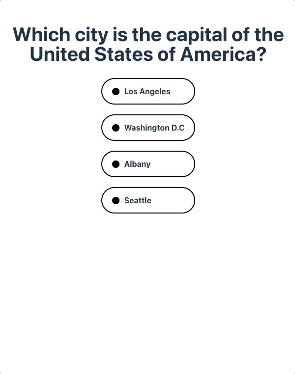

# classting Quiz

클래스팅 개발자 퀴즈 애플리케이션 입니다!

배포 url -> https://rainbow-marigold-563fa5.netlify.app/

### 실행 방법

```
$ git clone https://github.com/Jay-WKJun/classTing_work

$ cd classTing_work

// yarn이 이미 있다면 생략가능
$ npm install -g yarn

$ yarn set berry

$ yarn dev

-> http://localhost:5173/ 에 접속!
```

# 🤩 퀴즈를 시작해보세요!


## 간단히 맞추고



## 명료한 결과까지!


# ⚙️ Tech Stack

- React
- Vite
- Yarn (pnp mode)
- tailwindcss
- rechart.js
